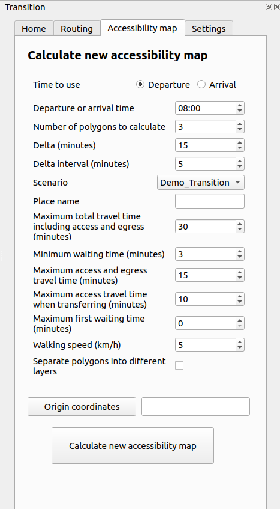

# Transition QGIS
Transition es a QGIS plugin allowing to interact with the transit planning application Transition.\
Before using this plugin, users need to install the Transition python library that this plugin depends on. To install it, use the following command :
```
pip install transition-lib
```
## Usage (end user)
Install `Transition` through the QGIS plugin manager.

When the plugin is open for the first time, users are prompt to enter their login credentials in order to be authentified with the Transition application.


The prompt also asks users for the URL of the server which, by default, is `http://localhost:8080` but can be edited by users. The authentication gets a token from the Transition application and will be saved if the user choses to maintain a connexion. When the token expires, the user will be prompted to login again for a new one. <!-- Me semble c'est pas actually handled presentemment, faudra l'ajouter -->

After a successful login, users have access to the plugin, which is a dockwidget.\
The dockwidget contains multiple tabs which are described in the following.

### Home page


The home page offers the following functionalities :
- Get the paths loaded in the Transition application.
- Get the nodes loaded in the Transition application.
The results for each request will be displayed as a layer in QGIS.


### Routing page


The routing page allows users to send a calculation request to the Transition application in order to receive a route. Users can choose transit modes, origin and destination points, as well as different parameters for transit, such as departure and waiting time.\
The result will bu displayed as a group layer containing a separate layer for the result of each mode. For transit, the alternative routes will be displayed in a sub-group containing all alternative routes. 

### Accessibility map page


The accessibility page allows users to send a calculation request to the Transition application in order to receive an accessibility map. Users can choose the origin point as well as different parameters such as the departure and waiting time.\
If **Separate polygons into different layers** is checked, the result will be a group layer containing a separate layer for each polygon. Otherwise, the result will just be one layer containing all the polygons.

## Contribute
To contribute to the Transition QGIS plugin, you can clone this reponsitory in `~/.local/share/QGIS/QGIS3/profiles/default/python/plugins/`. The plugin should then be added to your installed plugins.... To be continued...


