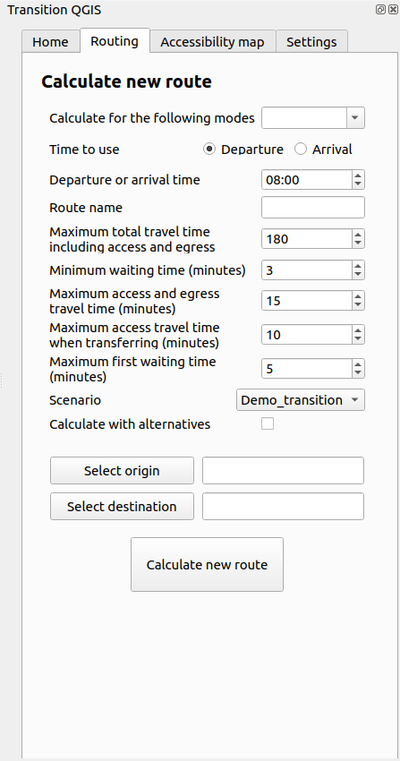

# Transition QGIS
Transition is a QGIS plugin designed to interact with the transit planning application Transition.\
Before using this plugin, users need to install the Transition python library that this plugin depends on in order to interact with the application. To install it, use the following command :
```bash
pip install transition-lib
```
## Usage (end user)
Install `Transition` through the QGIS plugin manager.

When the plugin is open for the first time, users are prompt to enter their login credentials in order to be authentified with the Transition application.


The prompt also asks users for the server URL that is to be used. By default, it is set to `http://localhost:8080` but can be edited by users. The login gets an authentication token from the Transition application. When the token expires, the user will be prompted to login again to get a new one.

After a successful login, users have access to the plugin, which is a dockwidget.\
The dockwidget contains multiple tabs which are described in the following.

### Home page


The home page offers the following functionalities :
- Get all the paths currently loaded in the Transition application.
- Get all the nodes currently loaded in the Transition application.
The results for each request will be displayed as a layer in QGIS.


### Routing page


The routing page allows users to send a calculation request to the Transition application in order to receive a route. Users can choose transit modes, origin and destination points, as well as different parameters for transit, such as departure and waiting time.\
The result will be displayed as a group layer containing a separate layer for each mode. 
For transit, if the **Calculate with alternatives** option is checked, multiple alternatives can be returned. When that is the case, the alternative routes will be displayed in a sub-group.

### Accessibility map page


The accessibility map page allows users to send a calculation request to the Transition application in order to receive an accessibility map. Users can choose the origin point as well as different parameters such as the departure and waiting time.\
If the **Separate polygons into different layers** option is checked, the result will be a group layer containing a separate layer for each polygon. Otherwise, the result will just be one layer containing all the polygons.

## Contribute

### Clone the repository and install dependencies
To contribute to the Transition QGIS plugin, you can clone this reponsitory in `~/.local/share/QGIS/QGIS3/profiles/default/python/plugins/`. The plugin should then be added to your installed plugins and can be visible in the plugin bar.\


In order to contribute to the project, you need to install the project dependencies. To do that, run the command :
```bash
pip install -r requirements.txt
``` 
You can then add or edit the code and see it reflected in QGIS. It is recommended to install the `plugin_reloader` plugin in QGIS in order to be able to easily reload the Transition plugin when files have been edited.

### Translate the plugin
When new code is added, the fileds that are going to be displayed in the QGIS UI need to be translated to french. In order to allow that, you first need to install QT Linguist.
The fields that are to be translated need to be wrapped in a `self.tr` clause. For example :
```python
CustomLabel(self.tr("Departure or arrival time"))
```
The files that need to be translated need to be specified in the `i18n/transition_qgis.pro`. Once all the files are added to the .pro file, you need to run the followind command in the `i18n` directory :
```bash
pylupdate5 transition_qgis.pro
```
After that, you can open the `transition_qgis_fr.ts` file in QT Linguist and write the translation of each field. Finally, once that is done, you need to run the following command in the `i18n` directory :
```bash
lrelease transition_qgis_fr.ts
```


