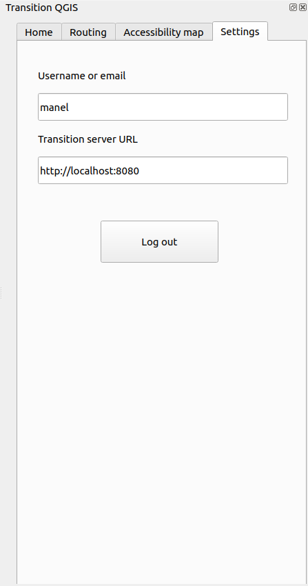

# Transition-QGIS
Transition-QGIS is a QGIS plugin designed to interact with the transit planning application Transition.\
Before using this plugin, users need to install the PYTransition python library that this plugin depends on in order to interact with the application. To install it, use the following command :
```bash
pip install pytransition
```
## Usage (end user)
Install `Transition-QGIS` through the QGIS plugin manager under Plugins > Manage and install plugins.


The Transition-QGIS plugin will then become available as an option in the "Plugins" tab and as an icon in the "Plugins" section of the QGIS toolbar.


When the plugin opens, users are prompted to enter their login credentials to authenticate with the Transition application.


Users also have to provide the URL to the Transition server. The default value is `http://localhost:8080`, but can it be edited. 
The login process retrieves an authentication token from the Transition application. When the token expires, the user will be prompted to login again to obtain a new one.

After a successful login, the plugin appears as a dockwidget.\
The dockwidget features multiple tabs, each of which is outlined below.

### Home page


The home page offers the following functionalities :
- Get all the paths currently loaded in the Transition application.
- Get all the nodes currently loaded in the Transition application.
The results for each request will be displayed as a layer in QGIS.


### Routing page


The routing page allows users to send a calculation request to the Transition application in order to receive a route. Users can choose transit modes, origin and destination points, as well as different parameters for transit, such as departure and waiting time.\
The result will be displayed as a group layer containing a separate layer for each mode.\
Users can also specify a route name to differenciate multiple routes. By default, if the ***Route name*** field is empty, the route name will be **Routing results**. If a new route is requested with the same name, it will replace the existing one.\
For transit, if the ***Calculate with alternatives*** option is checked, multiple alternatives can be returned. When that is the case, the alternative routes will be displayed in a sub-group.

### Accessibility map page


The accessibility map page allows users to send a calculation request to the Transition application in order to receive an accessibility map. Users can choose the origin point as well as different parameters such as the departure and waiting time.\
Users can also specify an accessibility map name to differenciate multiple accessibility maps. By default, if the ***Accessibility map name*** field is empty, the route name will be **Accessibility map results**. If a new accessibility is requested with the same name, it will replace the existing one.\
If the **Separate polygons into different layers** option is checked, the result will be a group layer containing a separate layer for each polygon. Otherwise, the result will just be one layer containing all the polygons.

### Settings page


The settings page contains read-only fields that display the connected user and the server URL currently being used. This mainly allows users to validate if the current URL is the desired one or if it needs to be changed.\
The page also allows users to log out from the plugin.  
